 
## 查看主页获取源码

> **作者介绍**： **✌**全网粉丝10W+本平台特邀作者、博客专家、CSDN新星计划导师、java领域优质创作者,博客之星、掘金/华为云/阿里云/InfoQ等平台优质作者、专注于项目实战 **✌**

  

### 一、作品包含

源码+数据库+设计文档万字+PPT+全套环境和工具资源+部署教程

### 二、项目技术

前端技术：Html、Css、Js、Vue、Element-ui

数据库：MySQL

后端技术：Java、Spring Boot、MyBatis

  

### 三、运行环境

开发工具：IDEA/eclipse

数据库：MySQL5.7

数据库管理工具：Navicat10以上版本

环境配置软件： JDK1.8+Maven3.6.3

前端Nodejs：14

### 四、项目介绍
项目编号：springbootA091

成都旅游网是一个致力于推广四川成都及周边地区旅游资源的综合性平台，旨在为游客提供全面、丰富、实时的旅游信息和服务。网站以成都的独特魅力为背景，融合了成都的历史文化、四季风光、特色美食、舒适住宿和丰富旅游资源，为用户打造一个了解成都、规划旅行、享受旅行的便捷窗口，助力成都旅游业的繁荣发展。

它分为前台和后台两个部分。

前台主要提供了首页、四季成都、特色文化、周末去哪儿、旅行社、景区信息、美食推荐、住宿推荐、成都特产、旅游行业、后台管理、咨询站、购物车和个人中心等功能。
后台则包括成都旅游网和后台模块。在后台模块下，又细分为管理员和用户两个子模块。管理员模块有系统首页、个人中心、用户管理、四季成都管理、特色文化管理、周末去哪儿管理、旅行社预约管理、景区类型管理、景区信息管理、美食分类管理、美食推荐管理、美食预约管理、住宿类型管理、住宿推荐管理、住宿预约管理、特产分类管理、成都特产管理和系统管理等功能。而用户模块则有系统首页、个人中心、旅行社预约管理、景区预约管理、美食预约管理和住宿预约管理等功能。

### 五、运行截图

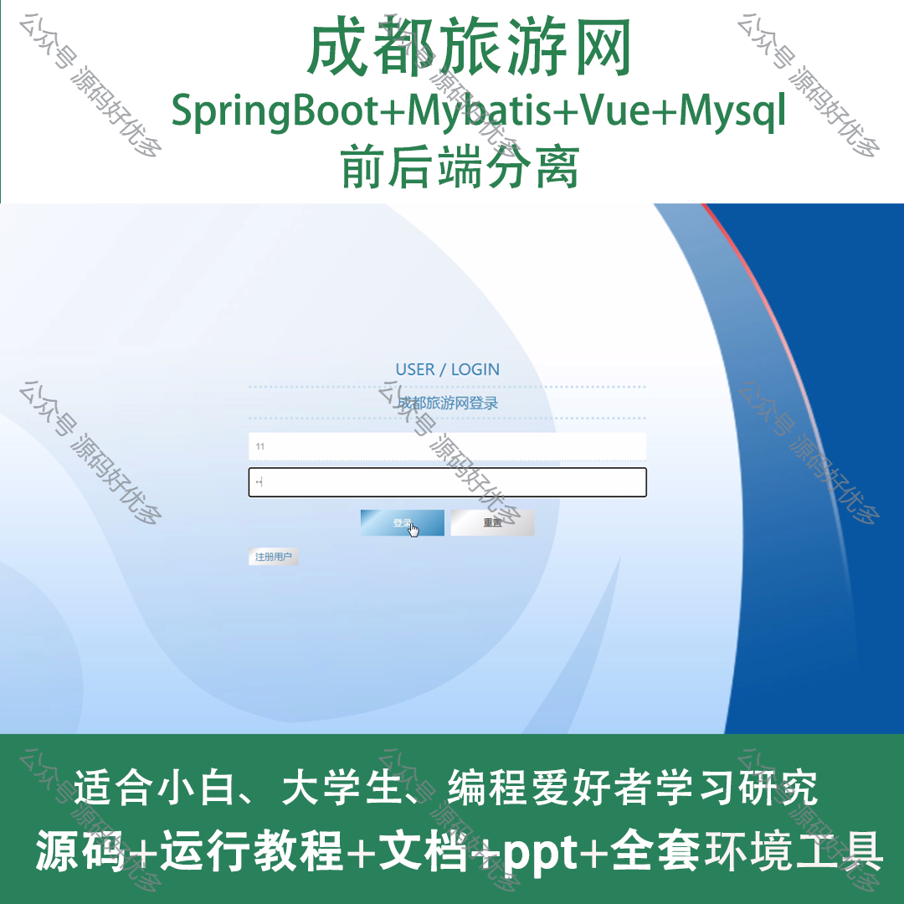
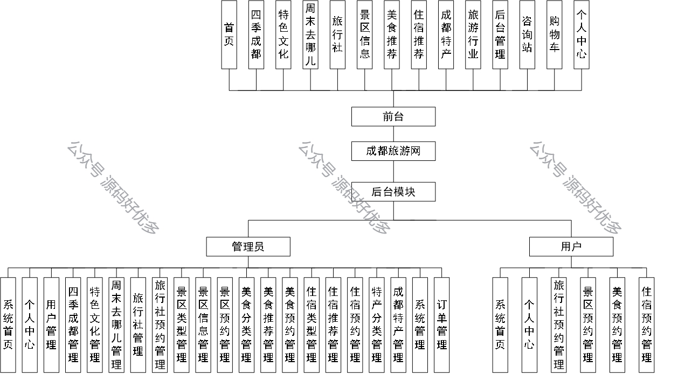
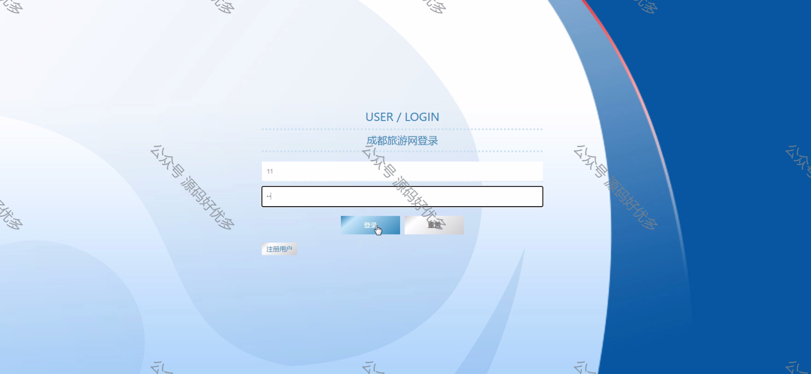
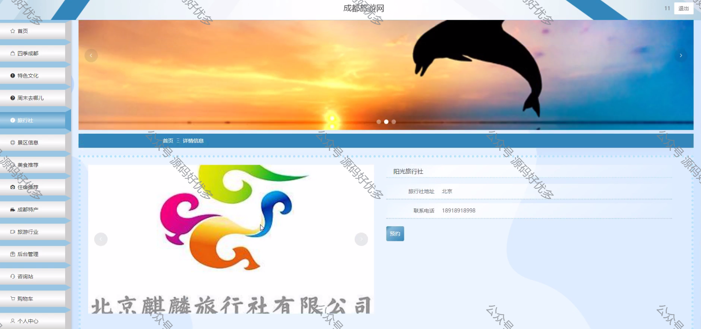
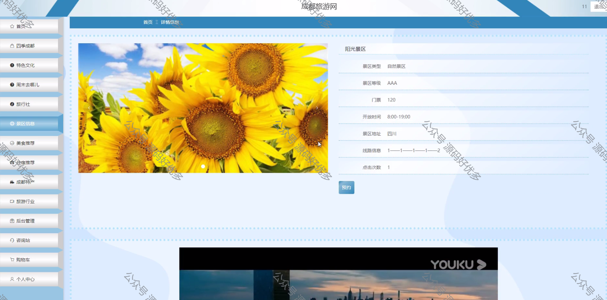
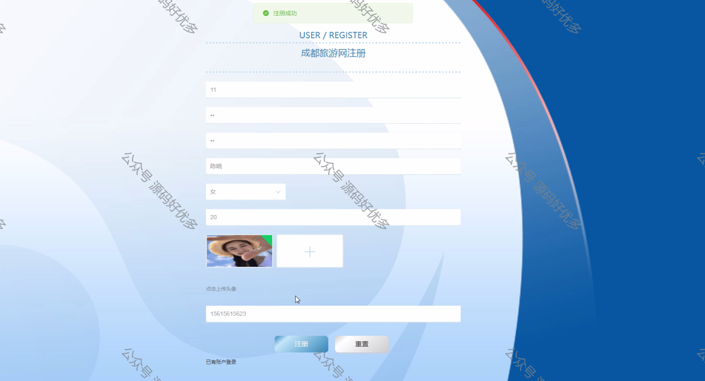
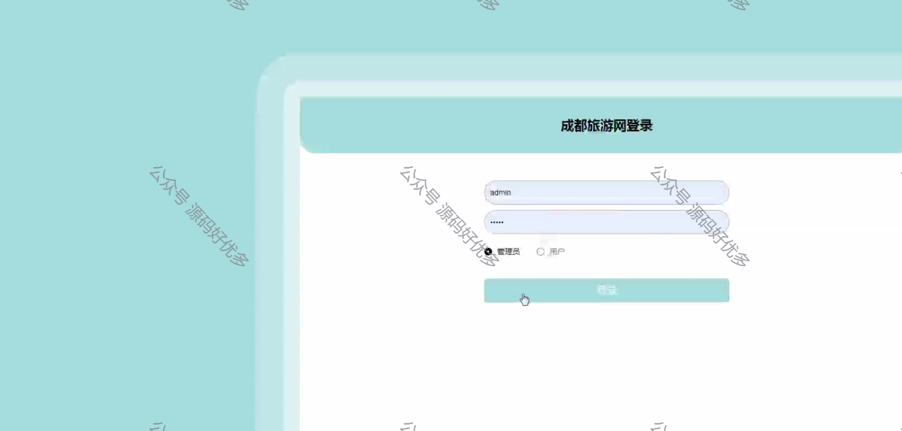
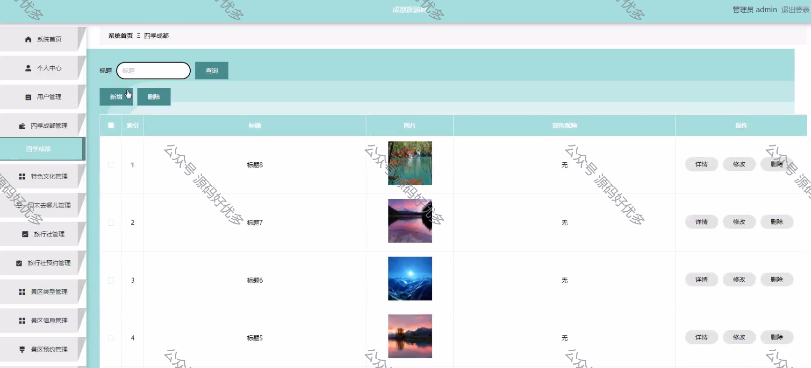
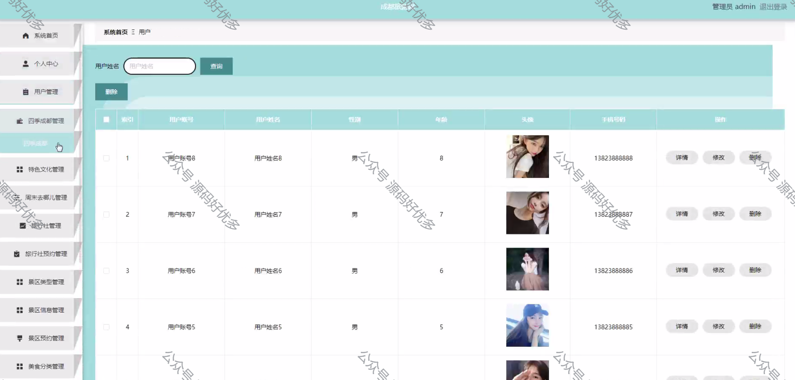
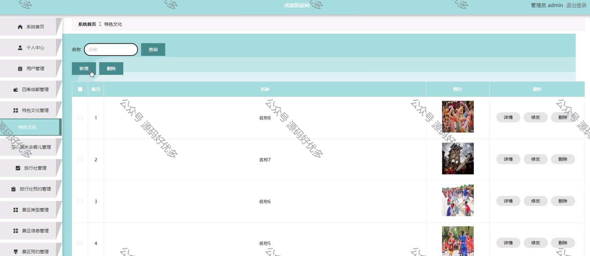
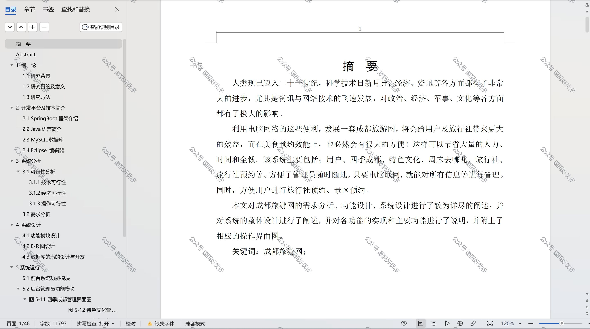

  
